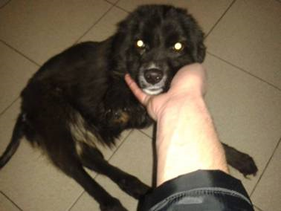
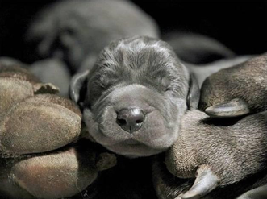

Liebe Tierfreude, das Schicksal dieser Hunde scheint besiegelt. Ein großes Rudel ist es ehemals gewesen. In einem Vorort von Belgrad nahe eines Friedhofs haben sich diese Hunde zusammengeschlossen. Alte, junge, kranke, verstoßene, und solche die schon ihr ganzes Leben auf der Straße sind. Sie haben den Sommer ohne Trinkwasser überstanden, und den Winter bis dato überlebt. In der Nähe eines Friedhofs leben sie in großer Gefahr. Sie sind dort unerwünscht. Die Totengräber haben auf die Hunde mit Schrot geschossen, einige wurden getroffen und haben nun Projektile im Körper. Mit Stöcken und Tritten versuchen sie die Hunde von diesem Gelände zu vertreiben. Manche Hunde haben deswegen schlimme Verletzungen davongetragen.
 
Einer davon ist Toby...

===

Durch einen Schlag auf den Kopf wirkt er orientierungslos und stößt stets gegen Objekte, obzwar beide Augen unbeschadet aussehen. Lediglich tränt ein Auge vermehrt, doch dies kann nicht die Ursache für diese Symptome sein. Man vermutet ein Hämatom im Kopf. Er findet schlecht Futter, schon für die gesunden Hunde ist es ein arger Überlebenskampf der kaum zu gewinnen ist....
 
Die Hunde haben niemanden der sie beschützt, niemanden der sie umsorgt. Eine gute Menschenseele versucht die Hunde mit Futter am Leben zu erhalten. In so unbändiger Hoffnung auf Hilfe hat dieser Engel in Menschengestalt einige Hundeseelen schon vor Monaten impfen, chipen und kastrieren lassen. Welch verantwortungsvolles Handeln für diese Hunde ohne Zukunft. Auch hat man ihnen liebevoll Namen gegeben, obzwar sie niemand ruft. Es sind neben Toby noch die drei Hundegeschwister Bell, Bella und Lara, - dies sind einige von diesen verlorenen Hunden. Ihre Freude so unermesslich wenn man ihnen Futter und ein wenig Zuwendung reicht. Toby mit der Kopfverletzung ist ein kastrierter Rüde, er wird als überaus friedvoll und gutmütig beschrieben. Diese Hunde stehen stellvertretend für diejenigen die noch keinen Namen haben, weil sie noch weit entfernt sind auf ein lebenswertes Leben zu hoffen. Viellicht geschieht ein Wunder und es können diese Seelen in eine bessere Zukunft kommen. Es wäre wunderbar in diese traurigen Hundeaugen Zuversicht zu zaubern....
 
Dringend würden wir Menschenengeln bzw. liebevolle Platzangebote für diese Hunde benötigen, damit ihr Leben gerettet werden kann. Toby ist kleiner und br äuchte sehr dringend tiermedizinische Hilfe! Wir hoffen so sehr, dass wir nicht zu spät kommen!!