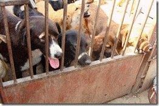

Liebe Tierfreunde,
wir suchen **DRINGEND** für unsere Hunde Pflegestellen bzw. Fixplätze!

Solange Menschen denken, dass Tiere nicht fühlen, müssen Tiere fühlen, dass Menschen nicht denken!
Sie möchten einem Tier ein Lebensretter sein und es dennoch nicht dauerhaft aufnehmen? Sie haben ein Herz für Tiere, haben Zeit, Liebe und Geduld zu verschenken?

Dann schreiben Sie uns!

Der Tierschutzverein Hundeseelen Nothilfe aus OÖ sucht dringend Pflege bzw. Fixplätze! Unser Verein betreut ein Straßenprojekt in Serbien.
Es warten so viele Sorgenhunde auf ein besseres Leben. Die Tiere wären vollständig geimpft, entwurmt, gechipt und kastriert.
Bitte helfen Sie uns helfen, ein Hundeleben zu retten!
Ein Leben im Elend - Hoffnungslosigkeit und Einsamkeit ihr täglicher Begleiter schutzlos ausgeliefert den Wetterverhältnissen, entweder hinter Gitter, an der Kette - oder notdürftige Unterkünfte!

Jedes Hundegesicht hat eine Seele!

**BITTE helfen Sie uns helfen - jedes Hundeleben zählt!**

