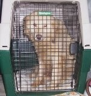

Quelle des Textes: [www.herzblutfuerkatzen.de](http://www.herzblugfuerkatzen.de)
mit freundlicher Genehmigung des Autors Silvio Fuchs

#### Ein Tierschutz-Hund zieht ein... 
Immer häufiger hört man in letzter Zeit von Hunden, die direkt vom Transport oder innerhalb der ersten Tage bei den neuen Besitzern entlaufen. Oft geschieht dies aus Unachtsamkeit der Transporteure, wie auch aus mangelndem Wissen bei den Adoptanten. Doch wie kann man die Risiken für ein Entlaufen auf ein Minimum senken und was ist wichtig?
##### Der Tierschutz-Hund
Fast immer handelt sich um Hunde mit einer ungewissen Vorgeschichte. Besonders die Tiere, die aus dem Ausland zu uns kommen, haben teilweise Grausames erlebt. Selbst wenn sie vor Ort als ruhig und lieb beschrieben werden, kann man nicht davon ausgehen, dass sie dieses Verhalten auch hier sofort zeigen. Der Stress des Transportes, die neue Umgebung, fremde Umwelteinflüsse sind nur einige Faktoren, die einem Hund sehr zusetzen. Wie er auf diese Faktoren reagiert, ist immer unterschiedlich und nicht absehbar. Dies sollte man sich stets vor Augen halten, wenn man sich für einen solchen Hund entschieden hat.
##### Die Abholung
Die Hunde kommen in mehr oder weniger großen Transporten oder mit einem Flugpaten hier in Deutschland an. Wenn Sie selbst einen Hund von einem solchen Transport abholen, gibt es ein paar wichtige Dinge, die beachtet werden sollten. Ein erfahrener und verantwortungsvoller Transporteur bzw. Flugpate wird ihnen stets mit Rat zur Seite stehen und Ihnen bereits im Vorfeld mitteilen, was es zu beachten gilt. Auch die verantwortliche Organisation / Verein wird vorab mit Ihnen den Ablauf durchsprechen. Leider wird dies aber auch oft vergessen, weshalb es nicht schaden kann, wenn Sie sich selbst vorab informieren.

Grundlegend gilt, dass Sie sich vorab über die Größe des Hundes informieren sollten. Anhand dessen sollten Sie ein Geschirr und ein Halsband aussuchen, welches Sie zur Abholung mitnehmen. Beides sollte sowohl enger wie auch weiter gestellt werden können, da die tatsächliche Größe des Hundes immer variieren kann. Das Halsband sollte keinen Schnappverschluss haben, da diese nicht so strapazierfähig sind.

Da die Hunde im Ursprungsland oft mit der Schlinge eingefangen wurden, reagieren viele mit einer extremen Panik auf Zughalsbänder. Auch wenn diese wegen der Verstellbarkeit am besten geeignet scheinen, sollten Sie darauf achten, dass diese Halsbänder einen individuell verstellbaren Stopp haben, so dass der Hund zwar gut gesichert ist aber ein Würgereiz vermieden wird.
Ebenfalls sollten zur Abholung zwei Leinen mitgebracht werden, die jeweils an Geschirr und Halsband befestigt werden. Bitte sparen Sie hier nicht am falschen Ende, sondern achten Sie auf die Qualität der Haken. Es kam leider schon vor, dass der Haken gerissen ist und der Hund deswegen entlaufen ist. Und bitte niemals eine Rollleine, sogenannte Flexi -Leine, mitbringen.

Dieser Hund ist mit einem Zughalsband und Geschirr perfekt gesichert. Anstatt der Koppelverbindung können auch zwei Leinen verwendet werden.

Wenn der Hund nun gut gesichert ist, sollten Sie schauen, dass er an einer ruhigeren Stelle sein erstes Geschäft verrichten kann. Behalten Sie den Hund stets im Blick, so dass Sie jederzeit handeln können. Bei sehr unsicheren und ängstlichen Hunden empfiehlt es sich, den Hund sofort "umzuladen" und erst in ruhiger Atmosphäre in einer gesicherten Umgebung auszuführen. Hier geht die Sicherheit ganz klar vor!
##### Transport von Hunden im eigenen Auto
Im Kofferraum von Kombis können Hunde sicher reisen. Voraussetzung dafür: ein passendes, sicheres Hundegitter zur Absicherung in den Autoraum (kein Netz!).

Bevor der Kofferraum verschlossen ist, hat der Hund immer die Möglichkeit durch die Heckklappe zu entwischen.
Um das zu verhindern empfiehlt sich folgendes Vorgehen: den Hund an die Leine nehmen - in den Kofferraum "bugsieren" - die Leine durch das Hundegitter zur Rückbank an einen Helfer weitergeben und dann den Kofferraum zu verschließen.
So kann der Hund abgeleint werden - man braucht sich keine Sorgen machen, dass er während der Fahrt sich angeleihnt verfängt. Zudem stellt man so sicher, dass der Hund sich durch Zuschlagen der Kofferraumklappe nicht verletzt.
Beim Aussteigen: Hund erst über die Rückbank anleinen - dann kann die Heckklappe geöffnet werden und der Hund sicher aus dem Kofferraum gelangen.

Auch durch eine Anschnallvorrichtung kann der Hund auf der Rücksitzbank gesichert werden. Noch besser ist natürlich eine stabile Transportbox. Mal davon abgesehen, dass Sie so ein plötzliches Entwischen verhindern, ist eine ausreichende Sicherung auch gesetzlich vorgeschrieben und wird bei Missachtung mit empfindlichen Geldstrafen geahndet.

Eine stabile Transportbox ist die sicherste Unterbringung während der Fahrt
 

##### Besonderheiten am Flughafen
Wenn der Hund mit einem Flugpaten ankommt, gibt es ebenfalls ein paar Besonderheiten. Der Flugpate wird mit dem Hund in einer Box ankommen und Sie holen ihn am Ausgang ab. Versuchen Sie dann erstmal ein wenig Abstand zur Menge zu bekommen, um den Stressfaktor durch die vielen Menschen zu senken. Es empfiehlt sich, den Hund samt Box in die Behindertentoilette zu bringen, die es an jedem Flughafen gibt. Diese sind sehr geräumig und sie können sie von innen verschliessen. Erst hier öffnen Sie die Box und legen dem Hund Geschirr und Halsband an. Doppelt gesichert kann es dann nach draussen gehen.

Bei sehr ängstlichen Hunden verzichten Sie bitte darauf und setzen den Hund in eine mitgebrachte Box um bzw. sprechen Sie mit der verantwortlichen Organisation / Verein, ob sie die Flugbox samt Hund direkt ins Auto umladen können.
So sehr sie sich auch auf den Hund freuen, öffnen sie niemals die Box ohne sicherzugehen, dass der Hund nicht abhauen kann. Lieber etwas länger in der Box als entlaufen!

##### Besonderheiten beim Landtransport
Wenn der Hund über einen Landtransport den Weg zu ihnen findet, sollten ebenfalls ein paar wichtige Dinge beachtet werden. Oftmals warten bei solch einer Abholung viele Menschen auf ihre Hunde und alle sind aufgeregt und nervös. Lassen Sie sich davon nicht beeindrucken, sondern bewahren Sie sich einen kühlen Kopf.

Ein verantwortungsvoller Fahrer wird von Ihnen Halsband, Geschirr und Leinen entgegennehmen und sie dem Hund noch im Transportfahrzeug bei geschlossener Tür (!) anlegen. Wenn Sie den Hund so versorgt entgegennehmen, überprüfen Sie bitte als erstes nochmals den korrekten Sitz. Lassen Sie sich niemals den Hund ohne irgendetwas einfach auf den Arm drücken!

Es empfiehlt sich, eine Leine am eigenen Gürtel zu befestigen, so dass der Hund stets gesichert ist, selbst wenn Ihnen die andere Leine entgleitet. Wenn Sie den Hund so gesichert haben, gehen Sie abseits der ganzen Menge und versuchen Sie dem Hund Ruhe und Sicherheit zu vermitteln. Lassen Sie ihn sein erstes Geschäft verrichten und bringen Sie ihn dann schnellstmöglich zum eigenen Auto. Auch wenn der Hund lange in der Transportbox sass, sehen Sie von einem Gassigang an der Autobahn ab. Hier passieren leider die meisten Fehler und es entwischen bei solchen Situationen die meisten Hunde.

##### Ankunft im neuen Heim
Wenn nun Alles mit der Abholung geklappt hat und der Hund sicher im neuen Heim angekommen ist, sollten Sie trotzdem auf eine Sicherung achten.

In den ersten Tagen nach der Ankunft werden Sie den Hund kennen lernen und sehen, wie er sich verhält. Bis Sie ihn aber richtig einschätzen können, braucht es Zeit. Auf den ersten Gassigängen nach der Ankunft sollten Sie den Hund in jedem Fall weiterhin doppelt gesichert haben. Führen Sie den Hund an einer Schleppleine aus, aber niemals ohne Leine. Auch in Ihrem heimischen Garten sollte der Hund mit Schleppleine gesichert sein. Es können immer unentdeckte Schlupflöcher im Zaun sein bzw. schaffen manche Exemplare es auch über zwei Meter hohe Zäune und Mauern.

Achten Sie darauf, dass der Hund nie durch offen stehende Türen (oder auch Fenster) entwischen kann. Bevor Sie ihrem Besuch also die Tür öffnen schauen Sie erst, dass der Hund nicht schon startbereit hinter Ihnen steht. Besprechen Sie diese Regeln auch mit Ihren Familienmitgliedern. Es müssen alle Personen im Haushalt darüber Bescheid wissen und sich daran halten. Leider entwischen immer wieder Hunde, weil eine dieser Grundregeln missachtet wird.