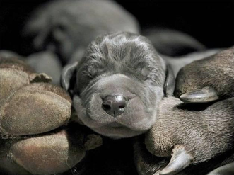

Lieber Tierfreund!
Sie möchten einem besonders armen Tier das Leben retten? Sie haben ein Herz für Tiere, haben Zeit, Liebe und Geduld zu verschenken?
Die besten Voraussetzungen wären somit gegeben! Wir suchen für unsere Hunde im Auslandsprojekt liebe Menschen, die einen Hund liebevoll und mit Wertschätzung bei sich aufnehmen!
Doch bedenken Sie, dass Tiere keine Möbelstücke sind. Der Einzug eines neuen Lebewesens wird im eigenen Haushalt, das eigene Leben nachhaltig ändern – dessen müssen Sie sich bewusst sein! Ein Tier ist keine Ware – ein  Tier ist ein Lebewesen, mit einer Seele voller Gefühlen und Empfindungen. All diese Tiere hatten ein Vorleben. Diese Hunde oder Katzen  benötigen gerade anfänglich viel Geduld und Einfühlungsvermögen des neuen Menschens , da sie sich völlig neu orientieren müssen, Altes vergessen und Neues erst erlernen müssen. Ebenso Menschen erst vertrauen und lieben zu lernen.  Viele Hunde schaffen das sehr schnell. Manche aber brauchen länger, werden durch die Umstellung wieder unsauber oder verfallen in eine Zerstörungswut. Das findet meist schnell ein Ende, kann aber manchmal auch länger dauern.
Diese Tiere haben Gefühle und können anfänglich mit der neuen Situation schwer umgehen. Das ist natürlich und gut so. Dies erfordert Geduld, Vertrauen und Liebe zum Tier. Sind Sie bereit, eine Umgewöhnungszeit eines Tieres mit allen Konsequenzen durchzustehen? 
Meist befinden sie sich noch in unserem Auslandsprojekt. Leider ist es uns nicht möglich umgehend und sofort die Tiere ins Inland zu holen. Wir sind stets bemüht so rasch als möglich, wieder einen Hilfstransport zu starten. Sehr wohl können wir die Ungeduld eines jeden verstehen, der auf sein neues Familienmitglied wartet. Doch müssen wir inständigst um ein wenig Geduld bitten, bis dass wieder eine handvoll Hunde/Katzenseelchen ein Platzticket in einem liebevollen Zuhause gefunden haben. Hier ist es uns ein ganz besonders Anliegen, auf Ihre Geduld zu appelieren, wenn Sie uns eine Zusage erteilen, dass ein Lebewesen von unserem Verein bei Ihnen einziehen wird. Leider werden durch kurzfristige – meist aus Ungeduld - getätigten Absagen ein Transport gefährdet und somit auch deren Leben und der anderen in den Startlöchern stehenden Seelchen,  durch eine Verschiebung des Transportes gefährdet.

#### Nachfolgende Vermittlungskriterien dienen zum Schutz der Hunde bzw. Katzen.

Unsere Vermittlungen erfolgen nach vorheriger Vorkontrolle. Sie bekommen nach gemeinsamer Terminvereinbarung einen Besuch von einem unserer Tierschutzhelfer. Diese Vorbesuche können in Österreich und in Deutschland erfolgen. Ohne einen Vorbesuch ist keine Vermittlung möglich!
Ist der Besuchsbericht positiv, nehmen wir mit Ihnen Kontakt auf und teilen Ihnen mit, wann Sie Ihr neues Familienmitglied in Empfang nehmen können.
Bei Lebensplätzen vermitteln wir gegen einen Schutzvertrag und einer Schutzgebühr.  Dieser Betrag ist kein Kaufpreis, sondern  stellt einen Unkostenbeitrag für Impfungen, Entwurmungen, Chipen und Kastration dar. Bei Rüden beträgt die Schutzgebühr 280,-- Euro, bei Hündinnen 300,-- Euro. Bei Katzen beträgt die Schutzgebühr  einheitlich 120,-- Euro.
Bei Pflegeplätzen werden die Tiere ebenso nach vorherigem persönlichen Kennenlernen gegen einen Pflegevertrag und ohne Schutzgebühr in ihr neues Pflegezuhause gegeben.  
Der Verein bemüht sich, den Hund so nahe wie möglich zu Ihnen zu bringen, mit etwas Glück bis nach Hause. Wir erwarten aber auch in manchen Fällen ein gewisses Entgegenkommen, da oftmals das neue Zuhause eines Hundes noch weite Fahrten für die anderen Fellnasen vom Transport teils nach Deutschlands erfordert. Wie der Hund / die Katze zu Ihnen kommt, muss also im Einzelfall abgesprochen werden.
Wenn Sie sich mit diesen Regeln identifizierne können und einem unserer Schützlinge ein neues Zuhause geben wollen, würden wir uns sehr freuen, wenn Sie mit uns Kontakt aufnehmen würden.